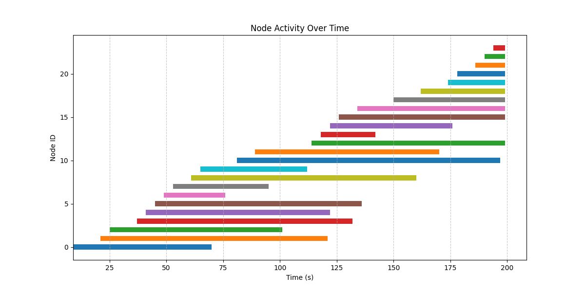
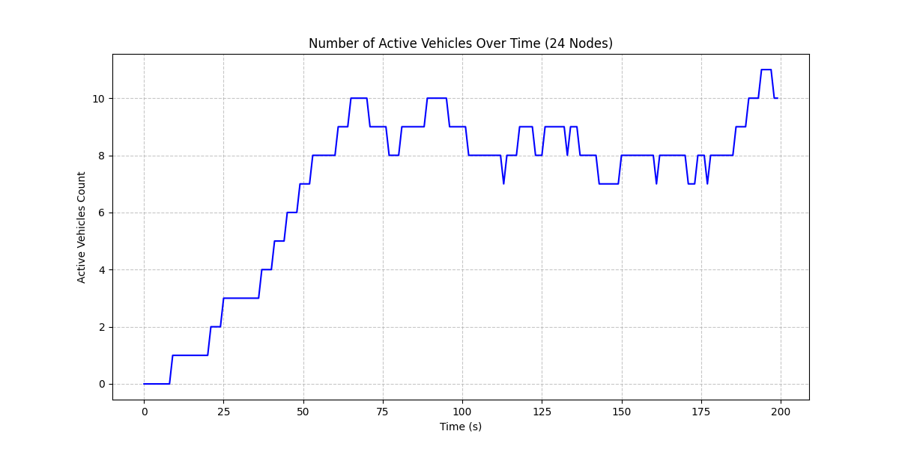

# Mobility Trace Generation for VANET 

This guide provides steps to generate mobility traces for VANET using OpenStreetMap (OSM) data and SUMO (Simulation of Urban MObility).

## Steps

### 1. Download the OpenStreetMap (OSM) Data
Go to [OpenStreetMap](https://www.openstreetmap.org/export#map=16/26.29755/73.03576&layers=T) and export the `map.osm` file. Customize the map as needed.

### 2. Rename the File
Rename the downloaded file to `map.osm.xml`.

### 3. Install SUMO and Tools
Install SUMO and its tools using the following commands:
```sh
sudo add-apt-repository ppa:sumo/stable
sudo apt-get update
sudo apt-get install sumo sumo-tools sumo-doc
export SUMO_HOME=/usr/share/sumo
```

### 4. Convert OSM Data to a SUMO Network with NetConvert
Convert the OSM data to a SUMO network using the following command:
```sh
netconvert --osm-files map.osm.xml -o map.net.xml
```
    
### 5. Generate Vehicle Mobility with SUMO
Generate vehicle mobility using the following command:
```sh
python /usr/share/sumo/tools/randomTrips.py -n map.net.xml -r map.rou.xml -b 0 -e 200 --insertion-density 60
```
- **--insertion-density:** How much vehicles arrive in the simulation per hour per kilometer of road
- **--period:** Sets the departure period between vehicles to seconds.

To visualize the generated vehicles on the map, use:
```sh
sumo-gui -n map.net.xml -r map.rou.xml
```
    
### 6. Export SUMO Mobility Traces for NS-3
Create a SUMO configuration file:
```sh
nano config.sumocfg
```
Write the configuration and save the file. Then, export the mobility traces:
```sh
sumo -c config.sumocfg --fcd-output map.fcd.xml
python /usr/share/sumo/tools/traceExporter.py -i map.fcd.xml -n map.net.xml --ns2mobility-output ns3mobility.tcl
```
Now you have the mobility traces ready for use in NS-3.

If you want to have an analysis of the density of nodes in the network over time, as well as the entry and exit times of nodes, you can use a Python file. Results attached! also you can find some results in `./200s-insertion-density-30-240` folder.
```sh
python3 plot.py
```



To simplify the generation of different scenarios on a map, a script file has been developed that you can customize and easily create different scenarios by running it. In the scenario below, the insertion density is set to 60.
```sh
./sumo_file_generator.sh 60
```

